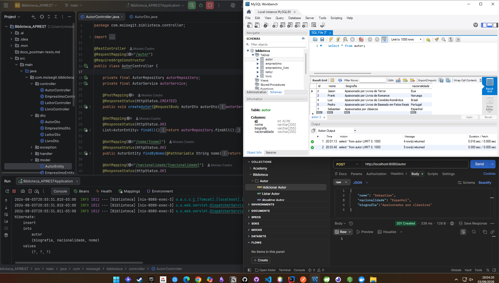

# 📚 Sistema de Biblioteca

API REST desenvolvida em **Spring Boot** para gerenciar uma biblioteca, permitindo operações de CRUD em **Autores, Livros, Leitores e Empréstimos**.

---

## 🚀 Tecnologias utilizadas
- Java 17
- Spring Boot
- Spring Data JPA
- Hibernate
- Lombok
- MySQL
- Postman (para testes)

---

## 🔗 Endpoints principais

### Autor
- `POST /autor` → Cadastrar autor
- `GET /autor` → Listar todos
- `GET /autor/nome/{nome}` → Buscar por nome
- `PUT /autor/{id}` → Atualizar autor
- `DELETE /autor/deletar/{id}` → Deletar autor

### Livro
- `POST /livro` → Cadastrar livro
- `GET /livro` → Listar todos
- `GET /livro/titulo/{titulo}` → Buscar por título
- `PUT /livro/idlivro/{id}` → Atualizar livro
- `DELETE /livro/{id}` → Deletar livro

### Leitor
- `POST /leitor` → Cadastrar leitor
- `GET /leitor` → Listar todos
- `GET /leitor/email/{email}` → Buscar por email
- `PUT /leitor/renovar/{id}` → Atualizar leitor
- `DELETE /leitor/{id}` → Deletar leitor

### Empréstimo
- `POST /emprestimo` → Realizar empréstimo
- `GET /emprestimo` → Listar todos
- `GET /emprestimo/{numeroEmprestimo}` → Buscar por número
- `PUT /emprestimo/renovar/{numeroEmprestimo}` → Renovar empréstimo
- `DELETE /emprestimo/delete/{numeroEmprestimo}` → Deletar empréstimo

---

## 📸 Exemplos de requisições no Postman

## 🧪 Teste - POST Autor

Este teste valida o endpoint responsável por cadastrar um novo autor na API.

**Descrição:**
- Método: `POST`
- Endpoint: `/autor`
- Status esperado: `201 Created`
- Resultado: Autor cadastrado com sucesso.

Os testes realizados estão organizados por entidade dentro da pasta `docs_postman-tests.md`:

- [Autor Tests](./docs_postman-tests.md/Autor-Tests)
- [Livro Tests](./docs_postman-tests.md/Livro-Tests)
- [Leitor Tests](./docs_postman-tests.md/Leitor-Tests)
- [Empréstimo Tests](./docs_postman-tests.md/Emprestimo-Tests)

Cada pasta contém os prints das requisições realizadas no Postman para os respectivos endpoints.

---

## 🧠 Autor
**Desenvolvido por:** Moises 
